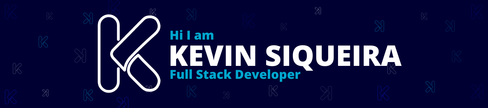

  

### My skills 🚀

   
   
     

   

### Databases 🖌️

   
   

### Package Manager 📦

   
   

    

### Tools 🧰

    
    

    
        

### Others 💻

   
    
   

### You can find me 📞

 

⭐️ By [@kevind3v](https://github.com/kevind3v)
